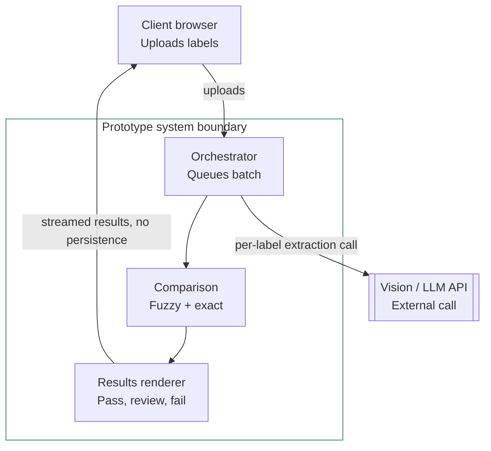

--# TTB label verification prototype

Checks a photograph of an alcohol beverage label against its submitted
application data, flagging brand name, class/type, ABV, net contents, and
government-warning compliance.

**See [ADR.md](./ADR.md) for the reasoning behind every design decision**
(no database, Python, a plain function instead of a class, etc.) — this
file covers setup and a brief summary.

Requirements are grounded in TTB's official checklists of mandatory label
information (distilled spirits, wine, malt beverage), cited by regulatory
section throughout ADR.md rather than vendored here — citing a spec, not
archiving it in the repo.

## Setup and run

### Backend

```bash
cd backend
python3 -m venv venv && source venv/bin/activate
pip install -r requirements.txt
export ANTHROPIC_API_KEY=your-key-here
uvicorn app.main:app --reload --port 8000
```

Visit `http://localhost:8000/docs` for an interactive test UI — useful for
verifying the backend before the frontend is involved.

Run the tests (no pytest required):

```bash
python3 tests/test_comparison.py   # comparison engine
python3 tests/test_batch_csv.py    # batch CSV parsing / filename matching
```

### Generating a test batch

`scripts/generate_test_batch.py` produces synthetic label images plus a
matching application-data CSV, so you can exercise the batch flow without
hand-making hundreds of files (needs Pillow — `pip install Pillow` in the
venv):

```bash
cd scripts
python generate_test_batch.py [count]   # count defaults to 300
```

It writes `test_labels/*.png` and `test_labels_application_data.csv`; in the
batch form, drop the images on the image zone and the CSV on the CSV zone
(matched by filename). It injects a deliberate mix — ~80% pass, ~10% brand
near-miss (→ review), ~10% warning-statement violation (→ fail) — so you can
watch real pass/review/fail counts at scale, and it renders "GOVERNMENT
WARNING" in a real cross-platform bold font so the bold check passes.

### Frontend

```bash
cd frontend
npm install
npm run dev
```

Open the printed local URL. The dev server proxies `/api/*` to the backend
on port 8000 (see `vite.config.js`).

### Deployment

Backend: a regular container/ASGI host (Render, Railway), **not** a
serverless-function platform — a 300-file batch upload can approach
serverless request-size limits. Set `ANTHROPIC_API_KEY` as an environment
variable, never in source.

Frontend: static build (`npm run build`) to Vercel/Render/Netlify, with
`/api` proxied or rewritten to the deployed backend URL.

**Cold start:** free hosting tiers (e.g. Render) sleep after ~15 minutes
idle; the first request after that can take 30-60 seconds. Use a paid
always-on tier, or a free keep-alive ping (e.g. cron-job.org hitting
`/health` every 10 minutes).

## Architecture



Everything inside the boundary runs locally. The vision API is the one
thing that leaves the system — isolated in `extraction.py` so it's the only
piece that would need to change if a real deployment's firewall blocked it
(ADR.md §4).

## Project structure

```
label-verifier/
├── backend/
│   ├── app/
│   │   ├── main.py            # FastAPI app — /verify, /verify/batch, /health
│   │   ├── extraction.py      # vision LLM call (the one external dependency)
│   │   ├── comparison.py      # fuzzy match + strict warning-statement check
│   │   ├── schemas.py         # request/response models (Pydantic)
│   │   └── config.py          # thresholds, upload limits, canonical warning text
│   ├── tests/
│   │   ├── test_comparison.py # scenarios from the stakeholder interviews
│   │   └── test_batch_csv.py  # batch CSV parsing / filename matching
│   └── requirements.txt
│
├── frontend/
│   ├── src/
│   │   ├── App.jsx            # single/batch verify forms + results table
│   │   ├── index.css          # plain, high-contrast styling
│   │   └── main.jsx           # entry point
│   ├── index.html
│   └── package.json
│
├── scripts/
│   └── generate_test_batch.py  # synthetic labels + CSV for batch testing
│
├── README.md                  # setup/run instructions (this file)
└── ADR.md                     # design decisions and reasoning
```

Flat and shallow on purpose — five backend modules, three frontend files.
No `services/`, `routes/`, or `types/` subfolders: at this scope, extra
layers add navigation overhead without adding clarity (see ADR.md).

## Approach, in brief

Requirements were split into explicit (stated in the interviews) and
implicit (inferred from context, anecdotes, or research) and ranked by
consequence, not source — full table in
[ADR.md §0](./ADR.md#0-requirements-traceability--explicit-vs-implicit-ranked).

- **Two comparison strategies**, not one generic score: fuzzy matching
  (tolerant of cosmetic differences) for brand name, class/type, and net
  contents; strict exact matching for the government warning, which is
  federally fixed and admits no variation.
- **One external dependency** (the vision call), isolated in
  `extraction.py`, so it's the only thing to change if a deployment's
  firewall blocks it.
- **Stateless** — nothing persists beyond a single request/response.

Full rationale, alternatives, and trade-offs are in [ADR.md](./ADR.md).

## Latency target: per-label, not per-batch

Sarah's "about 5 seconds" was a reaction to the prior vendor pilot's 30-40
*seconds-per-label* failure — a per-label expectation, not a batch-level
one. The batch requirement (200-300 labels at peak season) is a separate
need: eliminating serial, one-at-a-time processing, not matching 5 seconds
at 300x volume. A batch of 300 currently completes in roughly 1-2.5 minutes
(bounded by the global concurrency cap in `config.py` — ADR.md §7), a large
improvement over fully manual review even though it doesn't match the
per-label number literally. See ADR.md §0 for how this and other ambiguous
requirements were interpreted.

During that wait the batch upload shows a live progress meter — a real upload
percentage, then a per-label `142 / 300` count as results stream back from
the server. The design (streaming newline-delimited JSON, chosen over a
polled job so the app stays stateless) is in ADR.md §13.

## Scope

Targets **distilled spirits** labels specifically, checking the six
universally mandatory fields (brand name, class/type, ABV, net contents,
bottler name/address, government warning) per TTB's own "Checklist of
Mandatory Label Information — Distilled Spirits." Conditional fields
(country of origin, sulfite/coloring disclosures, age statements, etc.),
the "same field of vision" placement rule, beer/wine formatting rules,
image-quality robustness, and COLA system integration are explicitly out of
scope — see ADR.md §10–11 for the full list and why.
