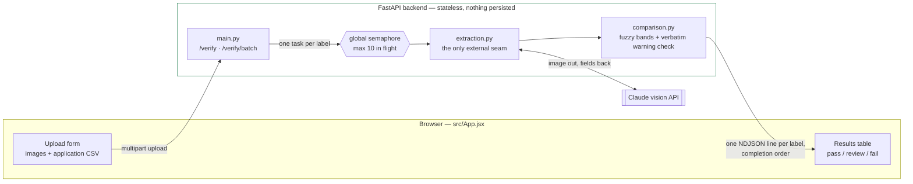

# TTB Label Verification Prototype

Checks a photograph of an alcohol beverage label against its submitted
application data, flagging brand name, class/type, ABV, net contents, and
government-warning compliance.

**See [ADR.md](./ADR.md) for the reasoning behind every design decision**

## Live demo

| | |
| --- | --- |
| App | https://label-verifier-web.onrender.com |
| API | https://label-verifier-api-y6pi.onrender.com |
| API health | https://label-verifier-api-y6pi.onrender.com/health |
| API docs | https://label-verifier-api-y6pi.onrender.com/docs |

The API's hostname has a `-y6pi` suffix because the plain
`label-verifier-api.onrender.com` subdomain was already taken; the frontend
reaches it through `VITE_API_BASE` (see [Deployment](#deployment)).

`GET /` on the API returns `{"detail":"Not Found"}` by design — the app
defines only `/verify`, `/verify/batch`, and `/health`. Use `/health` to
check that it is up.

## Setup and run

### Backend

```bash
cd backend
python3 -m venv venv && source venv/bin/activate
pip install -r requirements.txt
export ANTHROPIC_API_KEY=your-key-here
uvicorn app.main:app --reload --port 8000
```

Visit `http://localhost:8000/docs` for an interactive test UI — useful for
verifying the backend before the frontend is involved.

Run the tests (no pytest required):

```bash
python3 tests/test_comparison.py 
python3 tests/test_batch_csv.py  
```

### Generating a test batch

`scripts/generate_test_batch.py` produces synthetic label images plus a
matching application-data CSV, so you can exercise the batch flow without
hand-making hundreds of files (needs Pillow — `pip install Pillow` in the
venv):

```bash
cd scripts
python generate_test_batch.py [count]
```

It writes `test_labels/*.png`, `test_labels_application_data.csv`, and
`test_labels_expected.csv` In the batch form UI, drop the images on 
the image zone and the application-data CSV on the CSV zone.
Roughly 1/3 of the tests pass, 1/3 review, 1/3 fail.
The test cases fuzzy match or fail in a number of different ways to test 
the whole system.

### Frontend

```bash
cd frontend
npm install
npm run dev
```

Open the printed local URL. The dev server proxies `/api/*` to the backend
on port 8000 (see `vite.config.js`).

### Deployment

`render.yaml` defines both services, so Render's **New → Blueprint** flow
sets them up from the repo. Two values are deliberately left unset there
(`sync: false`) and must be entered in the dashboard:

| Service | Variable | Value |
| --- | --- | --- |
| `label-verifier-api` | `ANTHROPIC_API_KEY` | your key — never in source |
| `label-verifier-web` | `VITE_API_BASE` | the API's origin, e.g. `https://label-verifier-api.onrender.com` (no trailing slash) |

Deploy the API first, then set `VITE_API_BASE` to its URL and deploy the
frontend. `VITE_API_BASE` is inlined at build time, so changing it needs a
frontend redeploy, not just a restart.

Backend: a regular web service, **not** a serverless-function platform — a
300-file batch upload can approach serverless request-size limits. Render
injects `$PORT`; nothing in `app/` binds a port itself, so the port lives
only in the start command. `backend/.python-version` pins 3.12, because the
pinned `pydantic` predates 3.13.

Frontend: a static build talking to the API **cross-origin** (CORS is already
open — see security trade-offs below), rather than through a static-site
rewrite. A rewrite proxy would buffer `/verify/batch`'s NDJSON response and
break the live per-label progress the batch UI depends on. Locally none of
this applies: `VITE_API_BASE` stays unset and the Vite proxy handles `/api`.

**Batch size and memory:** `verify_batch` reads every upload into memory
before streaming results, so a full 300-image batch at the 1.5MB cap peaks
near 600MB once base64 copies are counted. That is why the API is on
Standard (2GB) rather than a 512MB free/starter instance. On a smaller
instance, lower `MAX_BATCH_SIZE` in `config.py` to match — roughly
`(instance MB / 2) - overhead`.

The frontend stays a **static** service: `vite build` emits plain
`index.html` + JS/CSS with no server-side rendering (ADR.md §3), so it is
CDN-served, free, and never cold-starts. Only the API is a running process.

**Cold start:** free hosting tiers (e.g. Render) sleep after ~15 minutes
idle; the first request after that can take 30-60 seconds. The Standard plan
in `render.yaml` is always-on, so this does not apply as configured — it
matters only if you drop the API to a free instance, in which case use a
keep-alive ping (e.g. cron-job.org hitting `/health` every 10 minutes), the
decision recorded in ADR.md §12.

## Architecture



Everything but the vision call runs locally, and nothing is written to disk
or a database. The vision API is the one thing that leaves the system —
isolated in `extraction.py` so it's the only piece that would need to change
if a real deployment's firewall blocked it.

## Project structure

```
label-verifier/
├── backend/
│   ├── app/
│   │   ├── main.py            # FastAPI app — /verify, /verify/batch, /health
│   │   ├── extraction.py      # vision LLM call (the one external dependency)
│   │   ├── comparison.py      # fuzzy match + strict warning-statement check
│   │   ├── schemas.py         # request/response models (Pydantic)
│   │   └── config.py          # thresholds, upload limits, canonical warning text
│   ├── tests/
│   │   ├── test_comparison.py # scenarios from the stakeholder interviews
│   │   └── test_batch_csv.py  # batch CSV parsing / filename matching
│   └── requirements.txt
│
├── frontend/
│   ├── src/
│   │   ├── App.jsx            # single/batch verify forms + results table
│   │   ├── index.css          # plain, high-contrast styling
│   │   └── main.jsx           # entry point
│   ├── index.html
│   └── package.json
│
├── scripts/
│   └── generate_test_batch.py  # synthetic labels + CSV for batch testing
│
├── README.md                  # setup/run instructions (this file)
└── ADR.md                     # design decisions and reasoning
```

Flat and shallow on purpose — five backend modules, three frontend files.
No `services/`, `routes/`, or `types/` subfolders: at this scope, extra
layers add navigation overhead without adding clarity (see ADR.md).

## Approach, in brief

Requirements were split into explicit (stated in the interviews) and
implicit (inferred from context, anecdotes, or research) and ranked by
consequence, not source — full table in
[ADR.md §0](./ADR.md#0-requirements--explicit-vs-implicit).

- **Two comparison strategies** fuzzy matching
  (tolerant of cosmetic differences) for brand name, class/type, net
  contents, bottler name/address, and country of origin; strict exact
  matching for the government warning, which is federally fixed and admits
  no variation.
- **One external dependency** (the vision call), isolated in
  `extraction.py`, so it's the only thing to change if a deployment's
  firewall blocks it.
- **Stateless** — nothing persists beyond a single request/response.

Full rationale, alternatives, and trade-offs are in [ADR.md](./ADR.md).

## Scope

Checks the six universally mandatory fields — brand name, class/type, ABV,
net contents, bottler name/address, and the government warning — across all
three product classes: **distilled spirits, wine, and beer/malt beverages**,
per TTB's own "Checklist of Mandatory Label Information" for each. ABV uses
the wider federal tolerance for wine at or above 14% (27 CFR); every other
check is class-independent.

**Country of origin** is compared when the applicant supplies it — blank
means not applicable, so it's checked for imports and skipped for domestic
products.

Out of scope: the remaining type-conditional disclosures (sulfite and
coloring statements, age statements, etc.), the "same field of vision"
placement rule, class-specific formatting rules, image-quality robustness,
and COLA system integration — see ADR.md §14 for the full list and why.